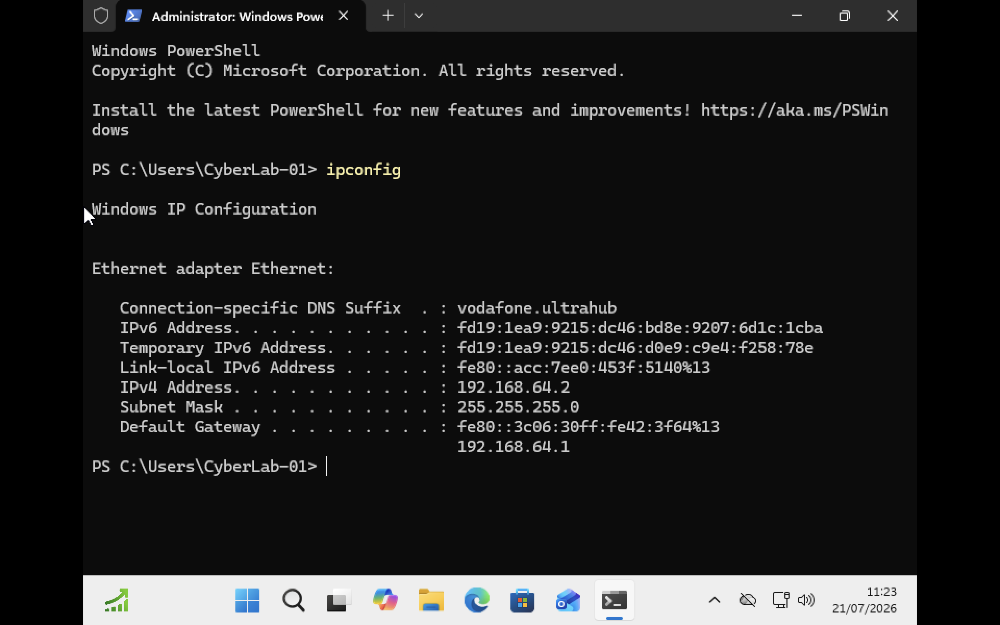
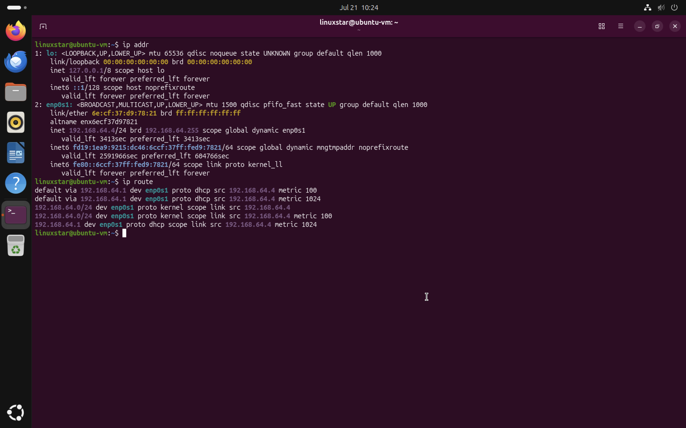
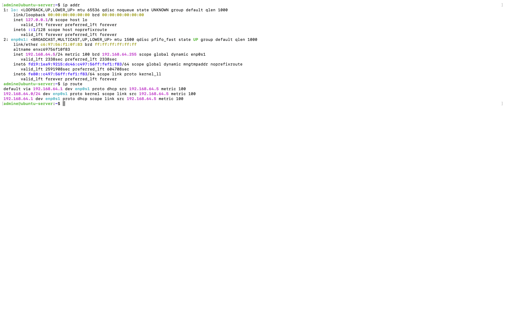
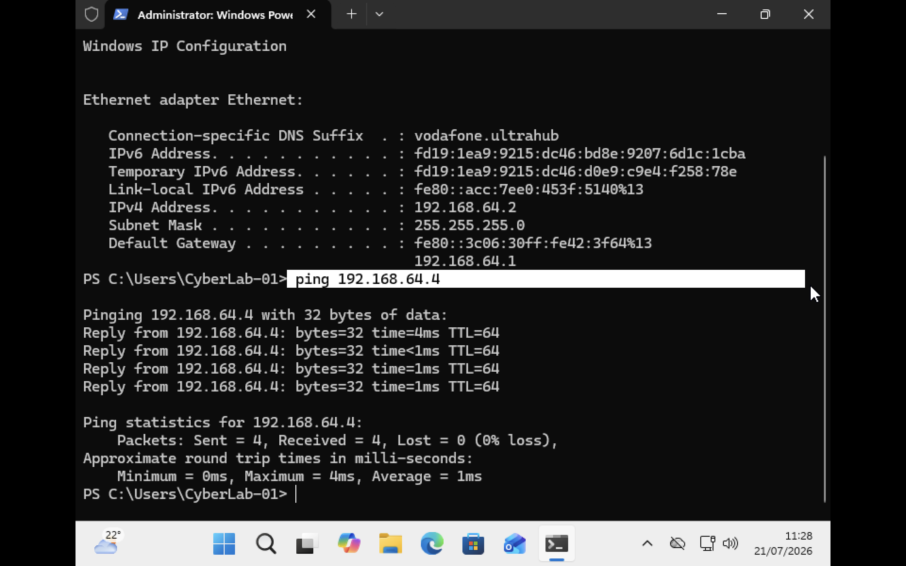
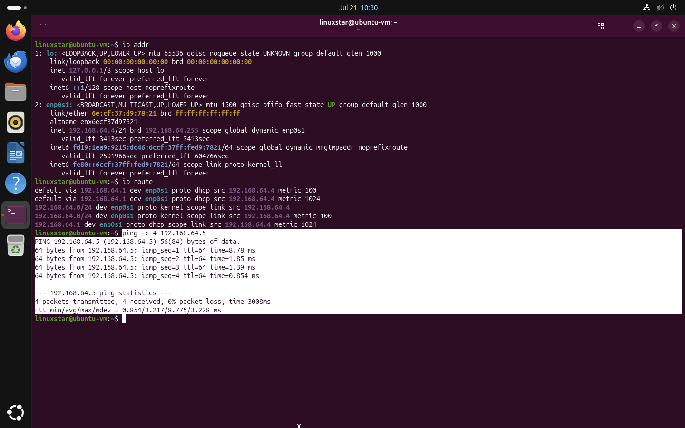
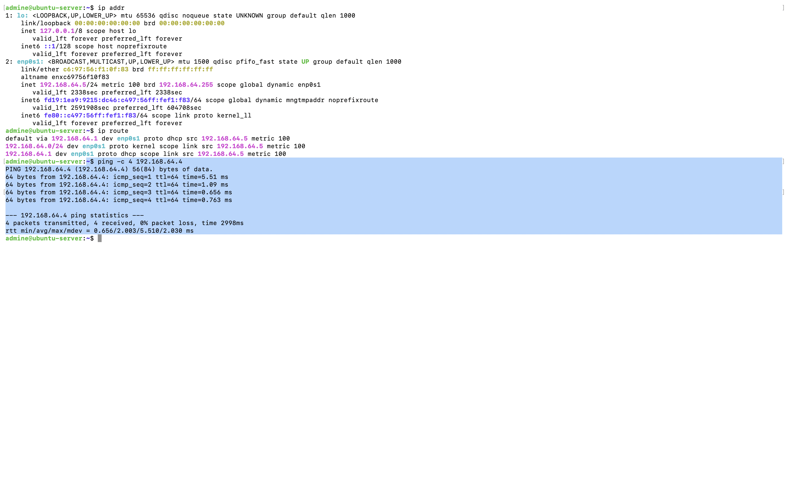
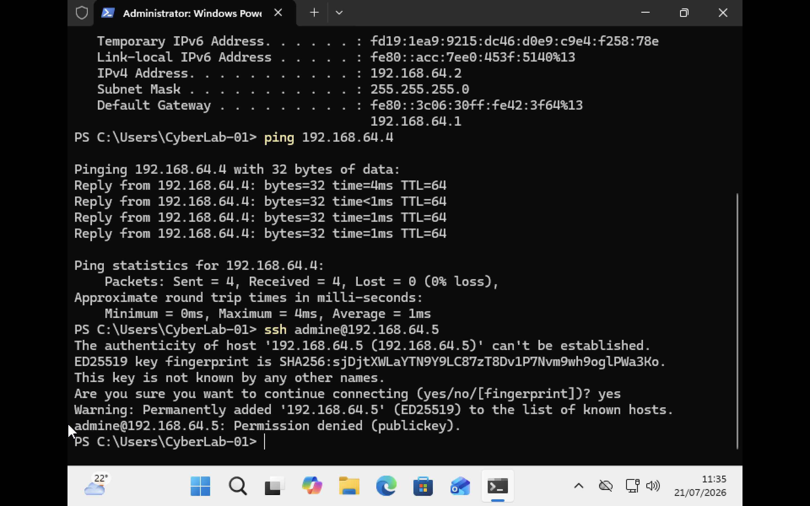

# Virtual Network Configuration

## Introduction
Network configuration is essential before conducting any security monitoring or behavioural analysis. Security events such as authentication attempts, PowerShell activity and network communication can only be investigated accurately if all systems are able to communicate across the same network. This chapter documents the configuration and verification of the virtual network used throughout the project. The objective was to ensure that each virtual machine could communicate successfully while maintaining an isolated environment suitable for controlled security monitoring experiments.

## Network Configuration

The laboratory uses a private virtual network created within UTM. All virtual machines are connected to the same subnet allowing communication between systems while remaining isolated from production environments.

| Machine | Role | IPv4 Address | Subnet Mask | Default Gateway |
|---------|------|--------------|-------------|-----------------|
| Windows 11 Workstation | Employee Workstation | **192.168.64.2** | **255.255.255.0** | **192.168.64.1** |
| Ubuntu Desktop | Administration Workstation | **192.168.64.4** | **255.255.255.0** | **192.168.64.1** |
| Ubuntu Server | SME Server | **192.168.64.5** | **255.255.255.0** | **192.168.64.1** |

The configuration confirms that all three virtual machines belong to the **192.168.64.0/24** private network.

## Network Verification

Before collecting any security evidence the network configuration of each virtual machine was verified using native operating system commands.

### Windows Workstation

The Windows workstation network configuration was verified using following command and it confirmed the assigned IPv4 address, subnet mask and default gateway.

```powershell
ipconfig
```
**Figure 3.1  Windows IP Configuration**




### Ubuntu Desktop

The `ip addr` command was used to identify the assigned network interface and IP address and `ip route` confirmed the routing configuration and default gateway.

**Figure 3.2  Ubuntu Desktop Network Configuration**



### Ubuntu Server
The Ubuntu Server network configuration was verified using following comands and it also confirmed that the server received the expected IP address and was correctly configured to communicate with the other virtual machines through the shared virtual network.
```bash
ip addr
ip route
```
**Figure 3.3  Ubuntu Server Network Configuration**




## Connectivity Testing

After verifying the network configuration, connectivity between the virtual machines was tested using ICMP echo requests (`ping`). The following communication paths were successfully verified:

| Source | Destination | Result |
|---------|-------------|--------|
| Windows 11 | Ubuntu Desktop | Successful |
| Ubuntu Desktop | Ubuntu Server | Successful |
| Ubuntu Server | Ubuntu Desktop | Successful |

All tests completed successfully with **0% packet loss** confirming reliable communication across the virtual network. Successful ICMP communication provides confidence that later authentication events, PowerShell activity and packet captures are generated within a correctly functioning environment.
**Figure 3.4 Windows Workstation Pinging Ubuntu Desktop**


**Figure 3.5  Ubuntu Desktop Pinging Ubuntu Server**



**Figure 3.6  Ubuntu Server Pinging Ubuntu Desktop**


## SSH Connectivity Verification

The Secure Shell (SSH) service on the Ubuntu Server was tested from the Windows workstation. The connection successfully reached the SSH service and the server presented its host identification key. During the first connection attempt, the SSH host key fingerprint was accepted and stored within the client's `known_hosts` file.
Authentication was subsequently denied with the following message:

```text
Permission denied (publickey)
```
**Figure 3.7 SSH Authentication Attempt from Windows Workstation**



This behaviour was expected because the Ubuntu Server had previously been configured to allow **public key authentication only** during the Ubuntu Server Administration project. The unsuccessful login therefore demonstrated that:

- the network connection between the client and server was functioning correctly
- the SSH service was running and accepting incoming connections
- the server was enforcing its configured authentication policy by rejecting clients that did not possess an authorised private key

## Security Significance

Although this chapter focuses primarily on networking, the information collected forms the foundation for every subsequent investigation within the project. The recorded IP addresses uniquely identify each system during packet capture and log analysis. Successful connectivity testing confirms that communication failures observed later cannot be attributed to network misconfiguration. Additionally, verifying SSH accessibility establishes that authentication events generated in later chapters originate from a correctly functioning network service. Without first validating the network it would be difficult to distinguish between authentication failures caused by security controls and failures caused by basic connectivity problems.


## Summary

This chapter successfully established and verified the virtual network used throughout the laboratory.

All three virtual machines were confirmed to operate within the same private subnet and successfully communicate with one another using ICMP. Network routing and addressing were validated on each operating system, providing a stable platform for subsequent security monitoring activities.

Initial SSH testing confirmed that the Ubuntu Server was reachable across the network while also demonstrating that the previously implemented SSH hardening policy was correctly enforcing public key authentication.

The validated network configuration now provides a reliable foundation for Windows event collection, Linux authentication monitoring, packet capture using Wireshark and multi source log correlation in the following chapters.
