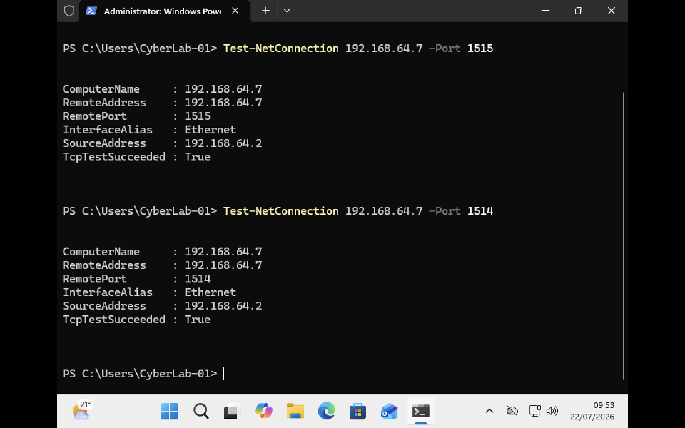
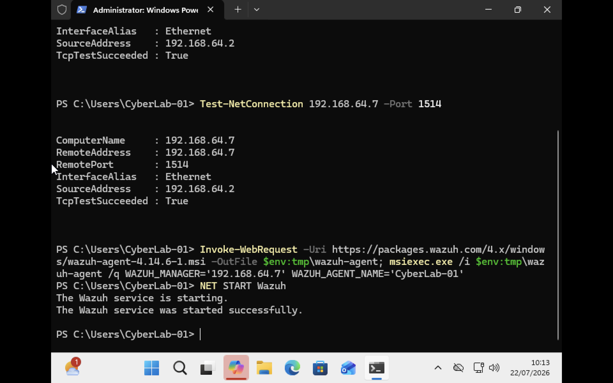
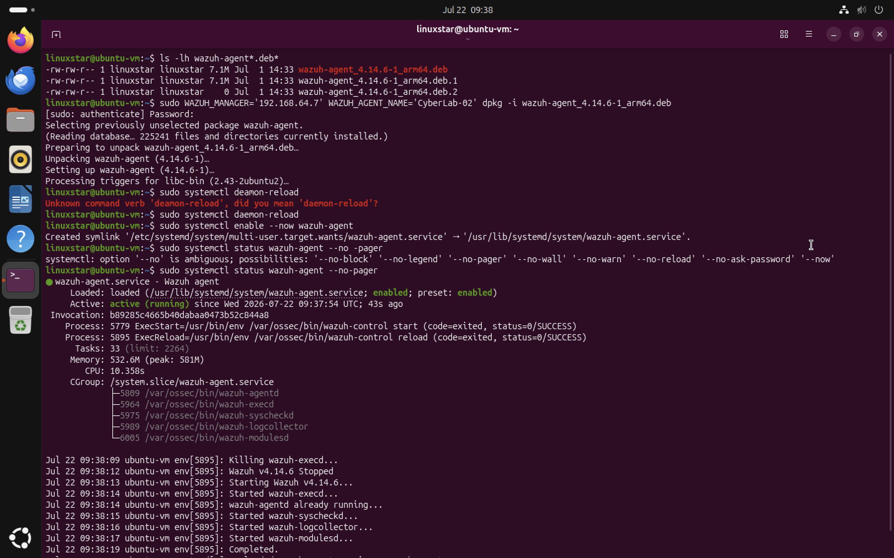
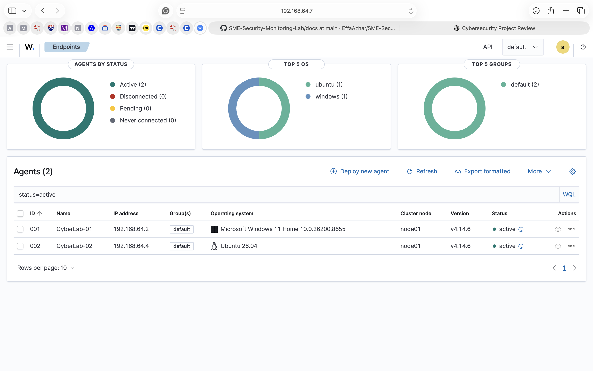

# Chapter 4 : Endpoint Agent Deployment

## Overview
After the successful deployment of the Wazuh server, the next phase of the project focused on integrating endpoint devices into the monitoring environment. Wazuh agents were deployed to both Windows and Ubuntu virtual machines, enabling the collection of security telemetry from multiple operating systems. Each endpoint was configured to communicate securely with the Wazuh Manager using the standard agent registration and communication ports. Once deployed the agents continuously forwarded security events to the central monitoring server, providing complete visibility across the simulated SME environment.

## Objectives
The objectives of this chapter were to:
- Verify network connectivity between the endpoints and the Wazuh server.
- Deploy the Wazuh agent on Windows 11.
- Deploy the Wazuh agent on Ubuntu Desktop.
- Register both endpoints with the Wazuh Manager.
- Verify successful communication between the agents and the monitoring server.

# Endpoint Environment

| Endpoint | Operating System | Agent Name |
|-----------|------------------|------------|
| Windows Workstation | Windows 11 | CyberLab-01 |
| Linux Workstation | Ubuntu Desktop 24.04 | CyberLab-02 |

Both systems were connected to the same virtual network as the Wazuh server, allowing secure communication with the SIEM platform.
# Connectivity Verification
Before installing the agents, network connectivity between each endpoint and the Wazuh server was verified.
The following tests were performed:
- ICMP connectivity (Ping)
- TCP Port 1515 (Agent Registration)
- TCP Port 1514 (Agent Communication)

# Windows Agent Deployment
The Windows endpoint was registered using the Wazuh Dashboard deployment wizard. During deployment, the following configuration was specified:
- Wazuh Manager Address
- Agent Name
- Windows Operating System
After installation, the Wazuh Agent service was started successfully and automatically established communication with the Wazuh Manager. The successful deployment enabled Windows security telemetry to be forwarded to the SIEM platform for analysis.

# Ubuntu Agent Deployment
The Ubuntu Desktop endpoint was configured using the Linux deployment package provided by the Wazuh Dashboard. The deployment process included:
- downloading the appropriate Wazuh agent package
- installing the package
- configuring the manager address
- assigning the endpoint name
- enabling the Wazuh Agent service
After installation, the agent service was verified to ensure it was running correctly and communicating with the monitoring server.


# Agent Registration

Once both deployments completed successfully, the Wazuh Dashboard automatically registered the endpoints.
The dashboard confirmed:

- Windows endpoint connected
- Ubuntu endpoint connected
- Both agents reporting as **Active**
- Endpoint operating systems correctly identified
- Agent versions successfully synchronised with the server

This confirmed that the SME monitoring environment was fully operational and capable of collecting telemetry from multiple operating systems.


# Endpoint Communication Flow

```text
                Security Events
                       │
                       │
     ┌─────────────────┴─────────────────┐
     │                                   │
┌───────────────┐                 ┌───────────────┐
│ CyberLab-01   │                 │ CyberLab-02   │
│ Windows 11    │                 │ Ubuntu Desktop│
│ Wazuh Agent   │                 │ Wazuh Agent   │
└───────┬───────┘                 └───────┬───────┘
        │                                 │
        └──────────────┬──────────────────┘
                       │
                TCP Port 1514
                       │
             Wazuh Manager Server
                       │
        Event Analysis and Correlation
                       │
               Wazuh Dashboard
```


# Verification
The environment was now capable of centralised monitoring across both Windows and Linux endpoints. Successful deployment was confirmed by:
- Active agent status
- Successful communication over the virtual network
- Endpoint operating systems detected automatically
- Security telemetry successfully forwarded to the Wazuh server

# Screenshots
Screenshots for this chapter.

**Figure 4.1:** Connectivity verification between the Windows 11 endpoint and the Wazuh server prior to agent deployment.

**Figure 4.2:** Successful installation and activation of the Wazuh agent on the Windows 11 endpoint.

**Figure 4.3:** Wazuh agent successfully installed and running on the Ubuntu Desktop endpoint.

**Figure 4.4:** Wazuh Dashboard confirming successful registration of both Windows and Ubuntu endpoints. Both agents are reporting an Active status and forwarding telemetry to the central monitoring server
# Key Findings
- Successfully deployed Wazuh agents on Windows 11 and Ubuntu Desktop.
- Verified secure communication between both endpoints and the Wazuh Manager.
- Confirmed successful agent registration using the Wazuh Dashboard.
- Established centralised telemetry collection across multiple operating systems.
- Prepared the SME monitoring environment for log analysis, file integrity monitoring and attack simulation.

# Conclusion

The deployment of endpoint agents completed the core architecture of the SME Security Monitoring Lab. Both Windows and Ubuntu systems were successfully integrated into the Wazuh platform, enabling continuous collection of security events from multiple operating systems. With endpoint telemetry now available, the monitoring environment was ready for behavioural analysis, file integrity monitoring, detection engineering and simulated cyberattack investigations in the following chapters.
