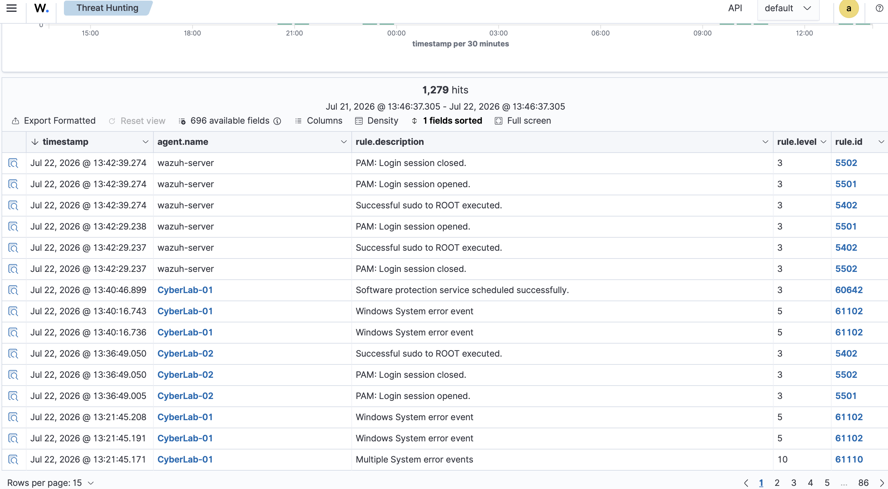

# Chapter 5 : Baseline System Activity

## Objective

Before generating simulated security incidents, it is important to understand what normal system behaviour looks like. Establishing a baseline allows security analysts to distinguish legitimate administrative activity from potentially malicious behaviour. Normal user activity was performed on both Windows 11 and Ubuntu Desktop endpoints while monitoring the resulting events within the Wazuh SIEM platform.

## Baseline Activity Performed

### Windows 11

The following administrative commands were executed using PowerShell:

```powershell
Get-Service
Get-Process
hostname
whoami
```

### Ubuntu Desktop

Several standard Linux commands were executed to generate normal endpoint activity.
```bash
mkdir baseline
cd baseline
nano notes.txt
cat notes.txt
```

## Monitoring the Generated Activity
Both Windows and Ubuntu endpoints were actively connected to the Wazuh Manager throughout testing. The Wazuh Dashboard was used to observe incoming telemetry from each monitored endpoint. Rather than producing security alerts for every command executed, Wazuh collected operating system events including:
- Successful authentication events
- Privilege escalation using `sudo`
- PAM login sessions
- Windows service events
- Operating system informational logs

This behaviour demonstrates an important concept in Security Information and Event Management (SIEM) not every system action is considered a security event. Instead, Wazuh prioritises meaningful operating system events while additional monitoring modules can be enabled to provide deeper visibility.

## Results

The generated baseline activity confirmed that:

- Both monitored endpoints successfully communicated with the Wazuh Manager.
- Security events were successfully forwarded from Windows and Ubuntu.
- Administrative activities such as authentication and privilege escalation were recorded.
- The monitoring infrastructure was functioning correctly before introducing more advanced detection techniques.
## Conclusion

Establishing a baseline is a fundamental step in security monitoring because it allows analysts to understand normal endpoint behaviour before investigating suspicious activity.

Although routine commands did not generate high severity alerts, they successfully produced operating system telemetry that confirmed communication between the monitored endpoints and the Wazuh SIEM platform. This validated that the monitoring infrastructure was operating correctly and was ready for more advanced security detection scenarios.


