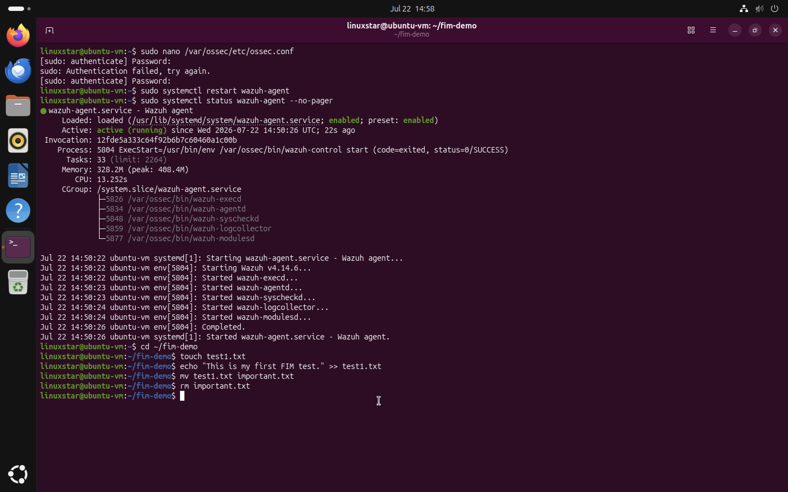
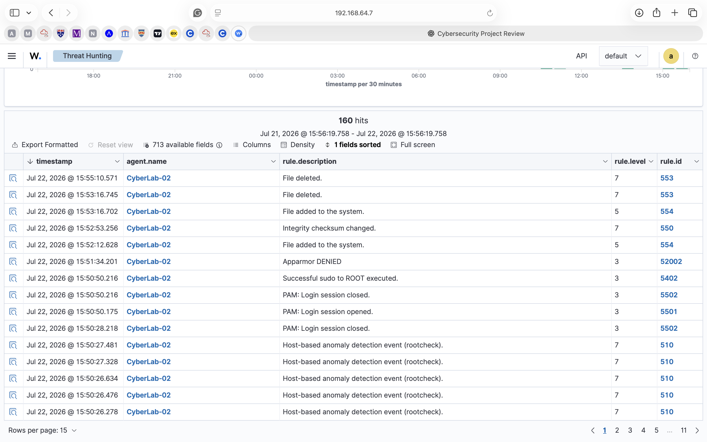

# Chapter 6 : File Integrity Monitoring (FIM)

## Objective

File Integrity Monitoring (FIM) is an important endpoint security capability that detects changes made to monitored files and directories. It helps security teams identify unauthorised modifications that may indicate malware infections, ransomware activity, privilege abuse or insider threats.
The objective of this chapter was to configure Wazuh File Integrity Monitoring on the Ubuntu endpoint and verify that file system changes were detected and forwarded to the Wazuh Manager in real time.

## Environment

| Component | Description |
|-----------|-------------|
| SIEM Platform | Wazuh 4.14 |
| Endpoint | Ubuntu Desktop 24.04 ARM64 |
| Monitoring Mode | Real-time File Integrity Monitoring |
| Agent | Wazuh Agent |
| Dashboard | Wazuh Threat Hunting |

## Configuring File Integrity Monitoring

A dedicated directory was created on the Ubuntu endpoint to safely generate test events without affecting system files.

```bash
mkdir ~/fim-demo
```

The Wazuh agent configuration file was then edited.

```bash
sudo nano /var/ossec/etc/ossec.conf
```

The following directory was added inside the `<syscheck>` section.

```xml
<directories realtime="yes">/home/linuxstar/fim-demo</directories>
```

After saving the configuration the Wazuh agent was restarted and verified

```bash
sudo systemctl restart wazuh-agent
```
```bash
sudo systemctl status wazuh-agent --no-pager
```

## Generating File Integrity Events

Several normal file operations were performed inside the monitored directory to generate normal activities.

### Create a file

```bash
touch test.txt
```

### Modify the file

```bash
echo "This is a test." >> test.txt
```

### Rename the file

```bash
mv test.txt notes.txt
```

### Delete the file

```bash
rm notes.txt
```

## Monitoring the Events

The generated activity was observed within the **Threat Hunting** section of the Wazuh Dashboard. These events were received almost immediately after the activity occurred, demonstrating successful real time monitoring by the Wazuh agent.
Wazuh successfully detected each file operation and generated security events including:
- File added to the system
- Integrity checksum changed
- File deleted


## Results

The practical exercise confirmed that:

- File Integrity Monitoring was successfully configured.
- The Ubuntu endpoint continuously monitored the configured directory.
- File creation generated an alert.
- File modification generated an integrity checksum alert.
- File deletion generated an alert.
- Events were successfully forwarded from the endpoint to the Wazuh Manager and visualised within the Wazuh Dashboard.

## Security Significance

Monitoring file system activity provides an additional layer of visibility that complements authentication logs, process monitoring and operating system event logs. File Integrity Monitoring is widely used to detect:
- Malware modifying system files
- Ransomware encrypting user data
- Unauthorised configuration changes
- Web server defacement
- Insider threats
- Privilege abuse
- Compliance violations

## Conclusion

This chapter demonstrated the successful implementation of File Integrity Monitoring using Wazuh. By monitoring a dedicated directory on the Ubuntu endpoint, real time alerts were generated for file creation, modification and deletion events.
The successful detection of these activities confirms that the monitoring infrastructure is functioning correctly and provides a foundation for the more advanced behavioural detection techniques implemented in subsequent chapters.


