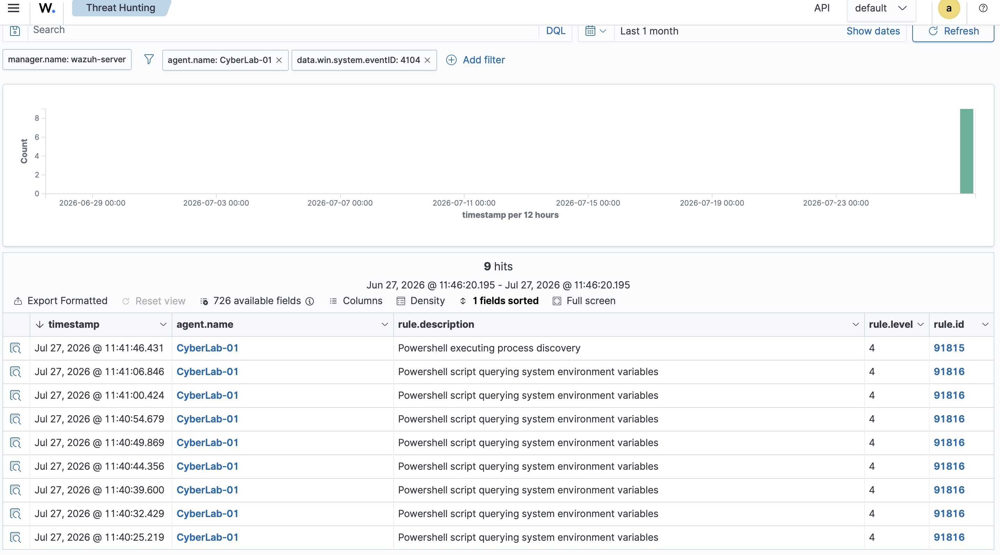
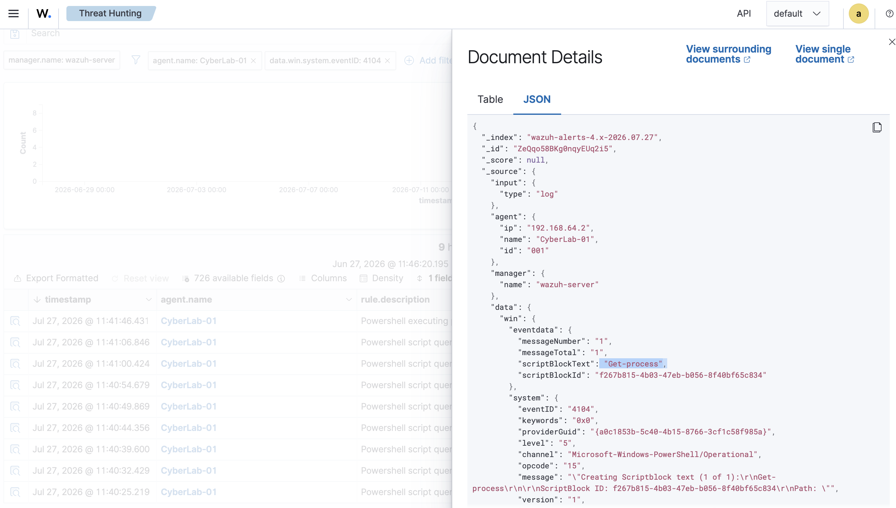
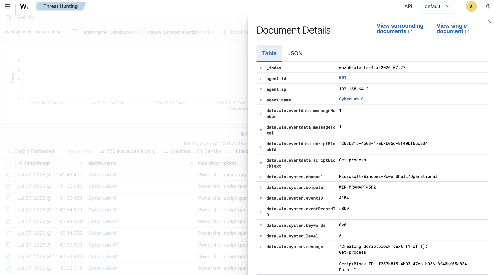

# Chapter 7 : PowerShell Script Block Logging

## Objective

The objective of this chapter was to extend endpoint visibility by enabling PowerShell Script Block Logging on the Windows endpoint. PowerShell is widely used by system administrators but is also heavily abused by attackers for reconnaissance, credential access, persistence and malware execution. By collecting PowerShell Operational logs Wazuh is able to record the actual PowerShell commands executed on the endpoint rather than simply recording that PowerShell was launched. This significantly improves detection capabilities and provides much richer telemetry for threat hunting.


## Why Script Block Logging?

PowerShell logging can operate at several levels. Script Block Logging records the content of PowerShell commands as they are executed making it possible to investigate administrator activity as well as suspicious attacker behaviour. This allows security analysts to
- Process discovery
- System information gathering
- Environment variable queries
- User enumeration
- Network reconnaissance

## Configuration

The Windows Wazuh Agent configuration file (`ossec.conf`) was updated to collect the PowerShell Operational Event Log.After updating the Wazuh Agent service was restarted to begin forwarding PowerShell Operational events to the Wazuh Manager. The following log source was added:

```xml
<localfile>
    <location>Microsoft-Windows-PowerShell/Operational</location>
    <log_format>eventchannel</log_format>
</localfile>
```

## Validation

To verify that Script Block Logging was functioning correctly, several PowerShell commands were executed. These events were successfully forwarded to the Wazuh Manager and indexed within the Threat Hunting dashboard.
```powershell
Get-Process
```
## Detection Results

The generated telemetry showed that Wazuh successfully collected Event ID **4104** from the **Microsoft-Windows-PowerShell/Operational** log. The dashboard generated detections including:

- PowerShell executing process discovery
- PowerShell script querying system environment variables

The JSON event also contained the complete Script Block Text, allowing the executed PowerShell command to be viewed directly from Wazuh.

## Evidence

### PowerShell Detection in Wazuh

The Threat Hunting dashboard successfully detected PowerShell activity generated from the Windows endpoint.



### Raw JSON Event

The JSON view confirms that Wazuh received the original Windows Event ID 4104 together with the Script Block Text.



### Parsed Event Details

The parsed event view demonstrates that Wazuh extracted important fields including:
- Agent Name
- Event ID
- PowerShell Operational Channel
- Script Block Text
- Windows Record ID
This structured data enables efficient searching, filtering and threat hunting.



## Learning Outcomes

Through this chapter I learned how to:

- Enable PowerShell Operational log collection.
- Configure Wazuh to monitor Event ID 4104.
- Restart and validate Wazuh Agent configuration.
- Generate PowerShell telemetry using legitimate administrative commands.
- Verify that events were successfully ingested into Wazuh.
- Inspect both parsed and raw JSON event data for threat hunting.
- Understand how PowerShell Script Block Logging improves endpoint visibility for detecting malicious activity.
