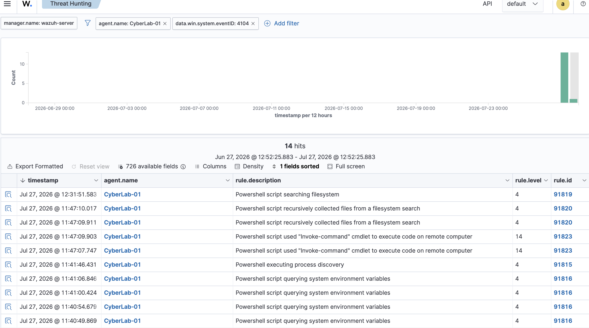

# Chapter 08 : Behavioural Detection and PowerShell Reconnaissance

## Research Question

**How can behavioural monitoring of PowerShell activity improve cyberattack visibility and assist security analysts in identifying reconnaissance behaviour on Windows endpoints?**

## Introduction

PowerShell is one of the most powerful administration tools available in Windows and is widely used by both system administrators and threat actors. Because PowerShell provides direct access to operating system functionality, it is frequently abused during cyber attacks for reconnaissance, credential access, persistence, lateral movement and post exploitation activities.

Traditional endpoint monitoring often records that **powershell.exe** was launched but provides little information about what was actually executed. This limits an analyst's ability to understand attacker behaviour during an investigation.

To address this limitation, PowerShell Script Block Logging was enabled on the Windows endpoint. Script Block Logging records the exact PowerShell commands executed, allowing detailed behavioural telemetry to be collected by the Wazuh agent and forwarded to the SIEM. This chapter demonstrates how behavioural monitoring improves endpoint visibility by capturing detailed PowerShell execution data and making it available for threat hunting.

# What is Behavioural Detection?
Behavioural detection is a security monitoring approach that focuses on **what a process does rather than what the process is called**. Instead of relying solely on signatures, hashes or known Indicators of Compromise (IOCs), behavioural monitoring analyses the actions performed by applications running on a system.  This approach enables defenders to detect suspicious activity even when attackers use legitimate Windows tools that would otherwise appear normal.
For PowerShell, this includes monitoring:
- Process execution
- Executed commands
- Script Block contents
- Administrative actions
- Enumeration behaviour
- Security policy queries
- File system searches
- Execution sequence and context

# What is Reconnaissance?

Reconnaissance is one of the earliest stages of a cyber attack. Before attempting privilege escalation, credential theft or lateral movement attackers typically collect information about the target environment.

Typical reconnaissance activities include:
- Enumerating running processes
- Discovering local user accounts
- Collecting environment variables
- Identifying the system hostname
- Reviewing password policies
- Examining account lockout settings
- Searching the file system
- Collecting operating system information

These commands are also frequently executed by legitimate administrators. Because of this, security analysts must evaluate the **behaviour, frequency and sequence** of commands rather than relying on a single event.

# Practical Activity

The following PowerShell commands were executed to simulate common reconnaissance behaviour.

| Command | Purpose |
|----------|----------|
| `Get-Process` | Process discovery |
| `hostname` | Identify endpoint hostname |
| `Get-LocalUser` | Enumerate local users |
| `Get-ChildItem Env:` | Enumerate environment variables |
| `secedit /export /cfg $env:TEMP\secpol.cfg` | Export local security policy |
| `Get-Content $env:TEMP\secpol.cfg` | Read exported policy |
| `Select-String MinimumPasswordAge` | Review password policy |
| `Select-String ResetLockoutCount` | Review lockout policy |
| `Remove-Item $env:TEMP\secpol.cfg` | Remove temporary configuration |

Each command generated Windows Event ID **4104**, which was collected by the Wazuh agent and forwarded to the SIEM.

# Behavioural Telemetry Collection

PowerShell Script Block Logging successfully recorded each executed PowerShell command. The Wazuh agent collected the generated Windows Event ID 4104 events and transmitted them to the Wazuh Manager, where they were indexed and became searchable within the Threat Hunting interface. Unlike traditional endpoint monitoring, the SIEM recorded the complete Script Block Text, allowing the exact commands executed on the endpoint to be reviewed during an investigation.

# Threat Hunting Results

The collected telemetry successfully identified several forms of reconnaissance behaviour, including:

- Process discovery
- Environment variable enumeration
- File system searches
- Local security policy analysis

Each event contained detailed forensic information, including:
- Endpoint name
- Agent ID
- Source IP address
- Windows Event ID
- Script Block Text
- PowerShell Operational Log
- Execution timestamp

This demonstrates that behavioural telemetry provides substantially more investigative context than simply recording the execution of powershell.exe.

# Improving Cyberattack Visibility

The primary research objective of this project is to investigate how endpoint telemetry can improve cyberattack visibility within a simulated SME environment. Without Script Block Logging an analyst may only observe that PowerShell was executed.nWith behavioural monitoring enabled, analysts can determine:
- Which commands were executed
- What administrative actions were performed
- Whether reconnaissance behaviour occurred
- Whether security policies were inspected
- Which system information was collected
- The sequence of attacker actions

This richer telemetry enables analysts to reconstruct attacker behaviour perform more effective threat hunting and investigate incidents with significantly greater confidence.

# What My Work Demonstrates

This practical exercise demonstrates that behavioural monitoring significantly improves endpoint visibility by collecting detailed PowerShell execution telemetry. The successful collection of Windows Event ID 4104 confirms that Script Block Logging was correctly configured and integrated with Wazuh. The SIEM successfully detected reconnaissance activities including:

- Process discovery
- Local user enumeration
- Environment variable collection
- File system searches
- Password policy inspection
- Account lockout policy inspection

Although these commands were executed as part of a controlled laboratory exercise, they closely resemble techniques commonly performed during the reconnaissance phase of real world cyber attacks. This demonstrates that behavioural telemetry provides richer investigative evidence than traditional signature-based monitoring and supports improved cyberattack visibility within a simulated SME environment. These findings directly contribute to the overall research question of this project:

> **How can host and network telemetry be correlated to improve cyberattack visibility in a simulated SME environment?**

# Conclusion

This chapter demonstrated how behavioural monitoring can improve endpoint visibility by collecting detailed PowerShell execution telemetry. Rather than simply detecting that PowerShell was launched, Wazuh successfully captured the complete Script Block Text and associated metadata for each command executed. These results provide practical evidence that behavioural monitoring enhances threat hunting, supports incident investigations and improves the detection of reconnaissance activity within SME environments.

# Evidence

## Figure 8.1 – PowerShell Process Discovery (Get-Process)

## Figure 8.2 – Environment Variable Enumeration (Get-ChildItem Env:)

## Figure 8.3 – Security Policy Inspection

## Figure 8.4 – Behavioural Detection Events within Wazuh Threat Hunting

