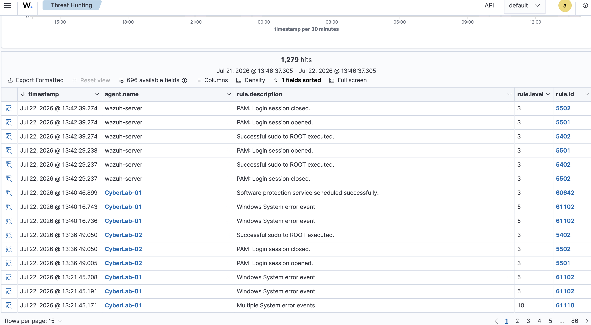
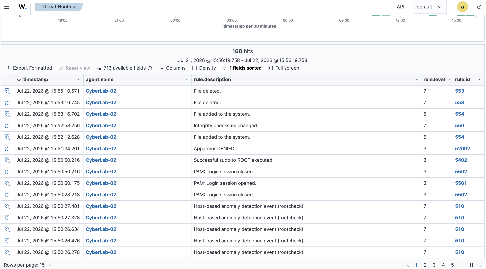
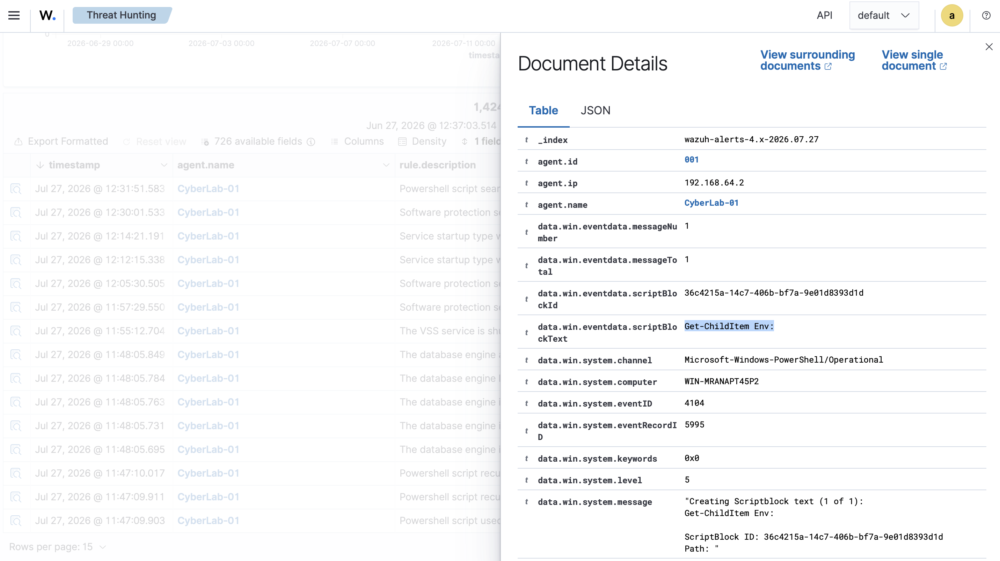
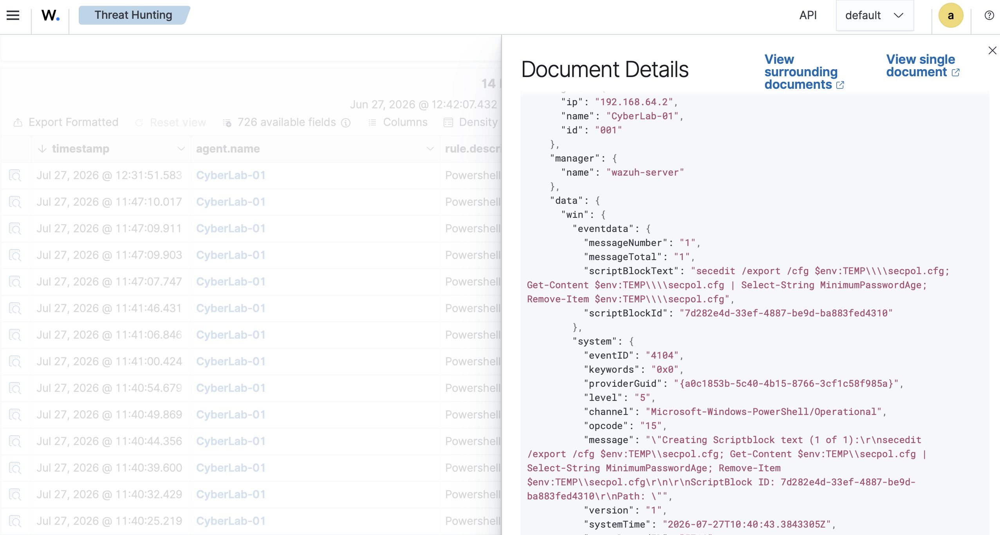
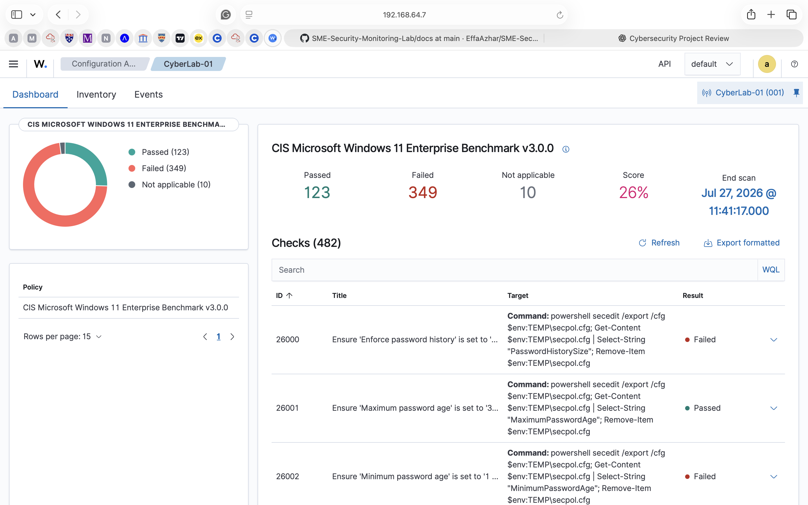

# Chapter 10 – Incident Investigation Through Alert Correlation

## Research Question

**How can multiple sources of endpoint telemetry be correlated to investigate suspicious activity and improve cyberattack visibility within a simulated SME environment?**

# Introduction

Modern cyber attacks rarely generate a single indicator of compromise. Instead, attackers leave behind multiple pieces of evidence across different logging sources such as process execution, file modifications, security configuration changes and operating system events. Analysing these events individually often provides only a partial understanding of an incident.Security analysts therefore rely on **alert correlation**  where evidence from multiple telemetry sources is combined to reconstruct attacker behaviour and understand the sequence of events that occurred during an investigation.

This chapter demonstrates how telemetry collected throughout this project can be correlated within Wazuh to investigate suspicious endpoint activity. Rather than introducing another monitoring capability, this chapter combines File Integrity Monitoring (FIM), PowerShell Script Block Logging, behavioural detections and Security Configuration Assessment findings into a single investigative workflow.

# Background Theory

## What is Alert Correlation?

Alert correlation is the process of combining multiple security events from different monitoring sources to identify meaningful patterns of activity. Rather than investigating isolated alerts independently, security analysts correlate events to answer following questions to get complete understanding of an incident,
- What happened?
- When did it happen?
- Which endpoint was involved?
- Which user executed the activity?
- Which files were modified?
- Was the endpoint securely configured?

## Why Alert Correlation Matters

Many legitimate administrative actions closely resemble attacker behaviour. For example, PowerShell may be used by both system administrators and threat actors. Similarly changes detected through File Integrity Monitoring may result from authorised maintenance or malicious tampering.

By correlating multiple telemetry sources, analysts gain additional context that improves investigative accuracy and reduces false positives. Within Security Operations Centres (SOCs) alert correlation is essential for reconstructing attack timelines, understanding attacker behaviour and prioritising incident response activities.

# Practical Activity

This investigation used telemetry collected throughout previous chapters of this project.

The following monitoring capabilities were correlated:

- Baseline system activity
- File Integrity Monitoring (FIM)
- PowerShell Script Block Logging
- Behavioural detections
- Security Configuration Assessment (SCA)

# Investigation Timeline

### Step 1: Establishing Normal Endpoint Behaviour

The investigation began by reviewing baseline endpoint activity to understand normal operating behaviour before analysing suspicious events. It provides an important point of comparison when identifying abnormal activity.

### Step 2: Detecting File Integrity Events

File Integrity Monitoring was reviewed to identify changes made to monitored files and directories. FIM provides visibility into file creation, modification and deletion events that may indicate unauthorised system changes.

### Step 3: Investigating PowerShell Activity

PowerShell Script Block Logging recorded the exact commands executed on the Windows endpoint. Unlike traditional process monitoring, Script Block Logging captured the complete PowerShell command text, enabling detailed behavioural analysis.

### Step 4: Identifying Reconnaissance Behaviour

Behavioural detections revealed PowerShell commands used to enumerate environment variables and collect system information. Although these commands were executed during a controlled laboratory exercise they closely resemble reconnaissance techniques frequently observed during the early stages of cyber attacks.

### Step 5: Reviewing Security Policy Enumeration

The investigation also identified PowerShell commands used to export and inspect local Windows security policies. This activity demonstrates how attackers may gather information regarding password policies and account security settings before attempting further exploitation.

### Step 6 – Reviewing Endpoint Security Posture

Finally, Security Configuration Assessment results were reviewed to understand the security posture of the investigated endpoint. Unlike behavioural monitoring, which explains what occurred, Security Configuration Assessment identifies security weaknesses that may increase the likelihood of successful attacks.

# Results

The investigation demonstrated that multiple telemetry sources could be successfully correlated within Wazuh to reconstruct endpoint activity. The investigation identified:

- Baseline endpoint behaviour
- File Integrity Monitoring events
- PowerShell Script Block events
- Behavioural detections
- Security policy enumeration
- Endpoint configuration assessment

# How This Improves Cyberattack Visibility

- Behavioural monitoring identifies suspicious activity occurring on an endpoint.
- File Integrity Monitoring identifies changes made to monitored files.
- Security Configuration Assessment identifies insecure operating system configurations.
- By correlating these telemetry sources, analysts can reconstruct attacker behaviour, understand the sequence of events leading to an incident and identify underlying security weaknesses that may have contributed to the attack.

This layered approach provides significantly greater cyberattack visibility than relying on isolated alerts or individual security controls.

# What My Work Demonstrates

This project demonstrates that effective endpoint monitoring requires more than collecting individual security events.

By integrating File Integrity Monitoring, PowerShell Script Block Logging, behavioural detections and Security Configuration Assessment within Wazuh, it was possible to investigate endpoint activity using multiple complementary sources of evidence. Rather than analysing isolated alerts the investigation reconstructed a timeline of endpoint behaviour allowing suspicious activity to be interpreted within its operational context.

This approach reflects real world Security Operations Centre (SOC) workflows, where analysts correlate telemetry from multiple monitoring capabilities to improve detection accuracy, support incident investigations and enhance cyberattack visibility. Within this simulated SME environment, the project demonstrates how combining behavioural monitoring with configuration assessment and integrity monitoring provides a more comprehensive understanding of endpoint security than any single monitoring capability alone.

# Conclusion

This chapter demonstrated how alert correlation enables security analysts to investigate suspicious endpoint activity by combining evidence collected from multiple monitoring techniques. The investigation successfully correlated baseline activity, File Integrity Monitoring events, PowerShell Script Block Logging, behavioural detections and Security Configuration Assessment findings to reconstruct endpoint behaviour. These findings reinforce the overall objective of this project by demonstrating that meaningful cyberattack visibility is achieved through the correlation of diverse telemetry sources rather than reliance on isolated security alerts.

